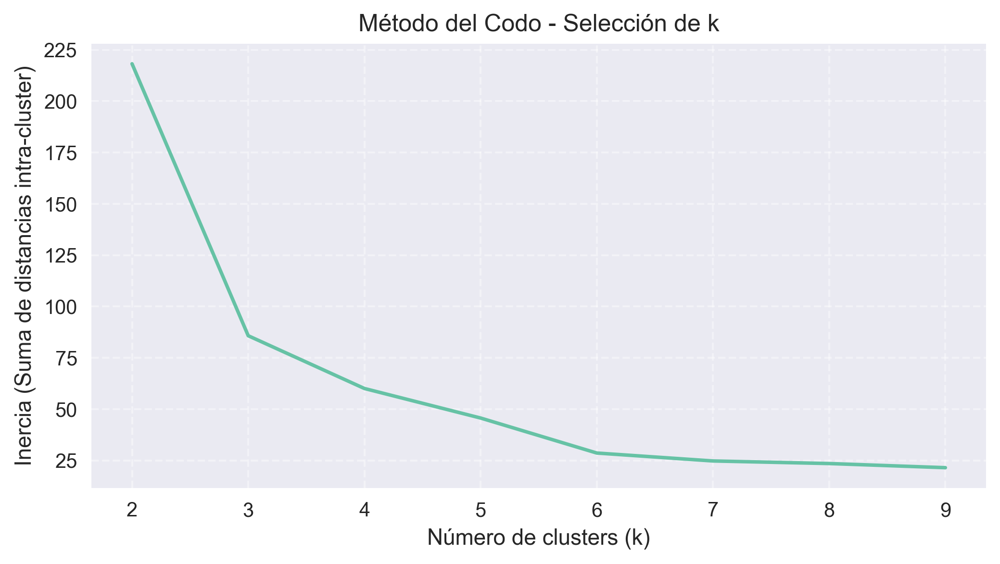
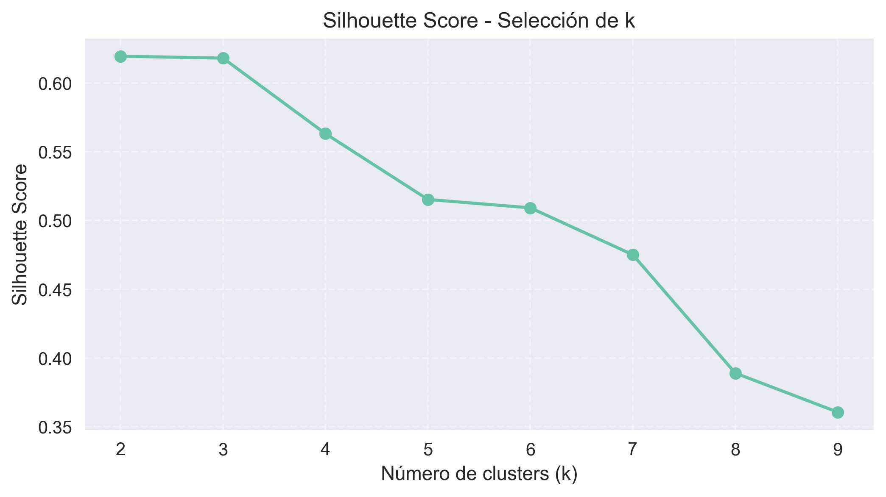
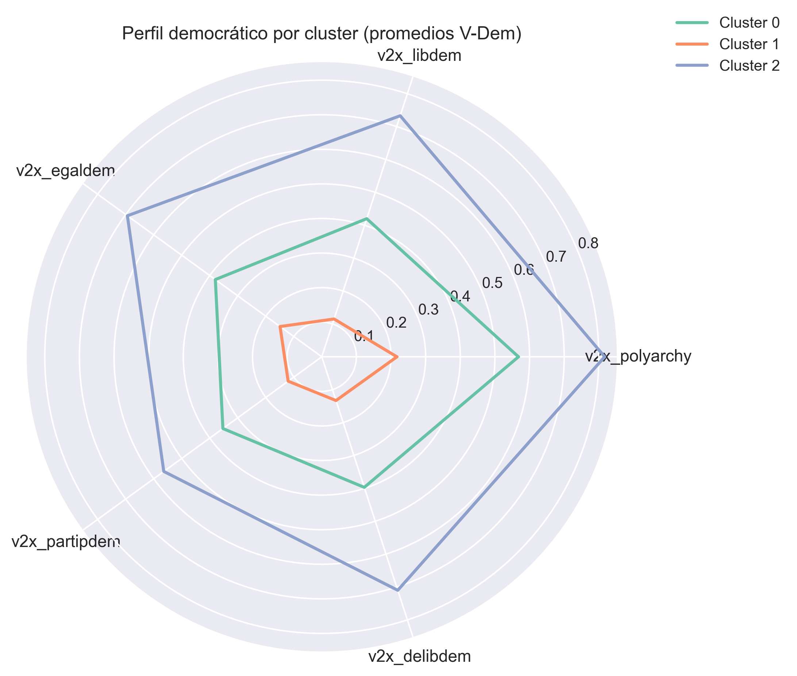
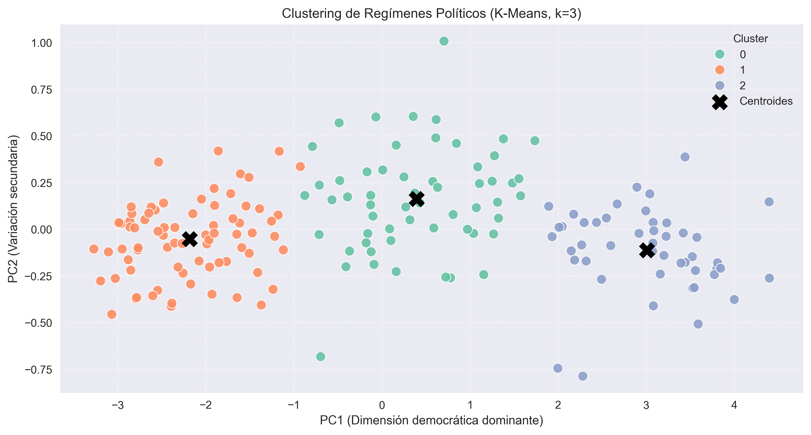
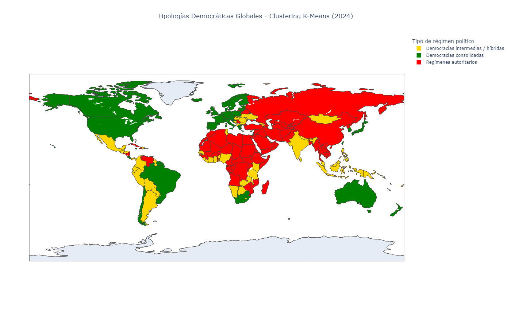

# 🌍 Tipologías Globales de Democracia (2024)  
**Clustering no supervisado con datos V-Dem**

🌐 Available in [English](README_EN.md)

Este proyecto identifica **tres tipos globales de regímenes políticos en 2024** utilizando clustering no supervisado y datos del dataset **V-Dem v15**, una de las principales bases de datos internacionales para el estudio comparado de la democracia.

Se combinan técnicas de **PCA** y **K-Means** para agrupar países según dimensiones democráticas clave (libertades civiles, igualdad política, participación, etc.).

---

## 🧰 Stack Tecnológico
- **Lenguaje:** Python 3.10.19
- **Librerías principales:**  
  `pandas`, `numpy`, `scikit-learn`,  
  `matplotlib`, `seaborn`, `plotly`, `kaleido`, `pycountry`
- **Data:** V-Dem Country-Year Core Dataset (2024)

---

## 📊 Flujo de trabajo reproducible

1️⃣ Selección y normalización de indicadores democráticos  
2️⃣ **PCA** → reducción de 5 dimensiones a PC1-PC2  
3️⃣ **Elbow + Silhouette Score** → k = 3  
4️⃣ Entrenamiento del modelo **K-Means**  
5️⃣ Interpretación institucional de clusters  
6️⃣ Visualización global (radar + mapa interactivo)  
7️⃣ Exportación del dataset etiquetado ✅

---

## 📈 Resultados principales

### 🔹 Validación del número óptimo de clusters

### 🔹 Perfiles democráticos (Radar Chart)

### 🔹 Visualización PCA

---

## 🧠 Tipologías resultantes
| Cluster | Interpretación | Regiones predominantes |
|--------:|----------------|----------------------|
| 🟢 2 | Democracias consolidadas | Europa Occidental, Oceanía, Norteamérica, Japón |
| 🟡 0 | Democracias intermedias / híbridas | América Latina, Europa del Este, Norte de África |
| 🔴 1 | Regímenes autoritarios | Medio Oriente, Asia Central, África Subsahariana |

📍 **Argentina** → Cluster 0: democracia electoral con **limitaciones en igualdad política y controles al poder**, según indicadores V-Dem

---

## 🌐 Mapa Mundo Interactivo

📌 *Explora país por país:*  
🔗 **Mapa interactivo online:**  
https://fernandezelias.github.io/VDem_Democracy_Clustering/figures/democracy_clusters_map.html

---

## 📁 Dataset final
✔ `data/processed/vdem_clusters_2024.csv`  
Incluye: país · PC1-PC2 · asignación final de cluster ✅

---

## 🚀 Próximos pasos
- Extender análisis a **series temporales (1990-2024)**
- Probar modelos alternativos: **DBSCAN, Gaussian Mixture Models**
- Comparar los resultados del clustering con clasificaciones externas de democracia, como:
  - **Freedom House – Freedom in the World (FiW)**
  - **Economist Intelligence Unit – Democracy Index (EIU)**

Estas comparaciones permitirán evaluar la coherencia del modelo con tipologías reconocidas internacionalmente y ampliamente utilizadas en Política Comparada y Geografía Política.

---

## ✍️ Autor
**Elías Fernández**  
📧 Contacto: fernandezelias86@gmail.com  
🔗 LinkedIn: [Perfil](www.linkedin.com/in/eliasfernandez208)

---

📌 Licencia: **MIT**